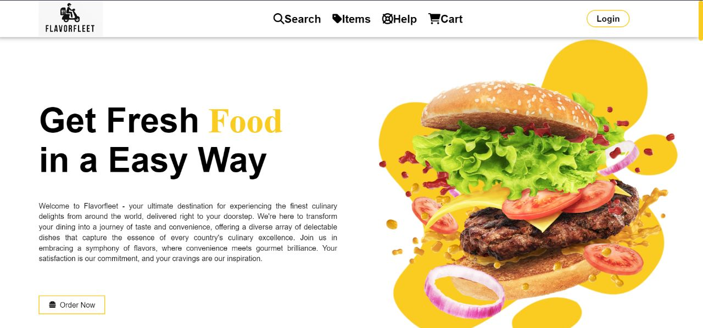
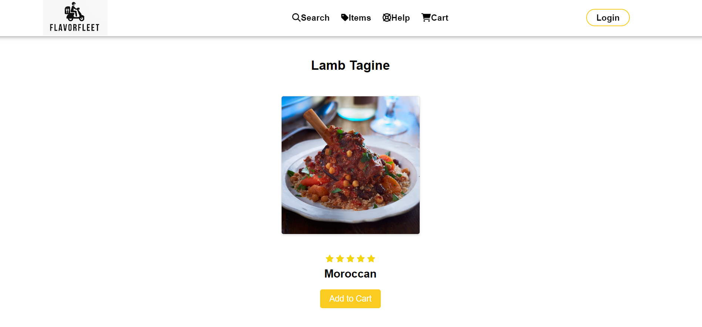
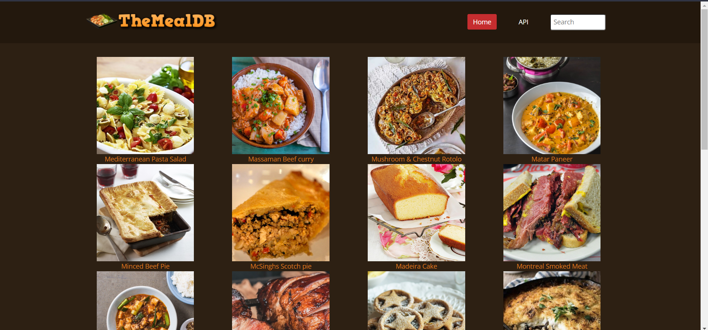

<h1 align="center">
    
    <font size="10">FlavorFleet</font>
</h1>

<p align="center">
  <i align="center">Explore the World of Flavor with FlavorFleet 🍔🌮🍰</i>
</p>

<h4 align="center">
    <a href="https://github.com/sagnik3788/FlavorFleet/graphs/contributors" style="margin-right: 10px;">
        
    </a>
    <a href="https://opensource.org/licenses/MIT" style="margin-right: 10px;">
        
    </a>
    <br>
    <a href="https://.com/discord" style="margin-right: 10px;">
        
    </a>
    <a href="https://twitter.com/SagnikD80478508" style="margin-right: 10px;">
        
    </a>
    <a href="https://www.youtube.com/watch?v=tHz1eVeVxic" style="margin-right: 10px;">
        
    </a>
</h4>


<p align="center">
    
</p>

## Table Of Contents 📚 
- [Demo YouTube Version](https://www.youtube.com/watch?v=tHz1eVeVxic&t=0s)
- [Introduction](https://github.com/sagnik3788/FlavorFleet/blob/main/README.md#introduction-)
- [Features](https://github.com/sagnik3788/FlavorFleet/blob/main/README.md#introduction-)
- [Development](https://github.com/sagnik3788/FlavorFleet/blob/main/README.md#development-)
  - [Pre-requisites](https://github.com/sagnik3788/FlavorFleet/blob/main/README.md#development-)
  - [Running Flavorfleet](https://github.com/sagnik3788/FlavorFleet/blob/main/README.md#development-)
- [Tech Stack](https://github.com/sagnik3788/FlavorFleet/blob/main/README.md#tech-stack-)
- [Contributing](https://github.com/sagnik3788/FlavorFleet/blob/main/README.md#contributing-)
  - [How to Contribute](https://github.com/sagnik3788/FlavorFleet/blob/main/README.md#how-to-contribute-)
- [Mentors](https://github.com/sagnik3788/FlavorFleet/blob/main/README.md#mentors-)
- [Contributors](https://github.com/sagnik3788/FlavorFleet/blob/main/README.md#contributors--)
- [License](https://github.com/sagnik3788/FlavorFleet/blob/main/README.md#license)


## Introduction 

Welcome to `Flavorfleet`, your passport to a world of culinary delights. We are an innovative and open-source culinary platform that brings together the finest dishes from every corner of the globe, prepared by top professional chefs hailing from diverse countries.

At Flavorfleet, we're on a mission to redefine the way we explore, create, and savor food experiences. Our extensive collection of delectable dishes showcases the best culinary traditions from around the world. Whether you're a seasoned chef seeking new inspirations or a passionate home cook eager to master the art of cooking, our platform is your gateway to a world of flavors.

From planning special dinners to venturing into uncharted cuisines, Flavorfleet is your trusted companion for all your food-related adventures. Join us on this gastronomic journey and elevate every meal into a memorable experience.

Embark on a culinary voyage like never before with Flavorfleet, your ultimate destination for exploring, creating, and savoring the finest food experiences from across the globe

<details open>
<summary>
 Features
</summary> <br />

<p align="center">
    
&nbsp;
    
</p>

<p align="center">
    
&nbsp;
    
</p> 
    
<p align="center">
    
&nbsp;
    
</p>
    
</details>

## Development 


<details open>
<summary>
Pre-requisites
</summary> <br />
To be able to start development  make sure that you have the following pre-requisites installed:

###

- Node.js
- Git
</details>

<details open>
<summary>
Running Flavorfleet
</summary> <br />

###

1. Clone the repository :
```shell
git clone https://github.com/sagnik3788/FlavorFleet.git  
```

2. Install Dependencies:
```shell
cd FlavorFleet
npm install
```
3. Build Docker image
```shell
docker build -t flavorfleet .
```
 Run Docker container
```shell
docker run -p 4000:4000 flavorfleet
```
Visit the application: (http://localhost:4000)

Alternatively, you can run the application without Docker:
```shell
# Install Dependencies
npm install


# Run user-server.js
node user-server.js
```

Visit the application: (http://localhost:4000)

The development environment should now be set up. Additional information on the different application component can be found under README.md file. Happy hacking! 👾
</details>

## Tech Stack 

- **Frontend:** HTML, CSS, JavaScript
- **Backend:** Node.js, Express.js
- **Database:** MongoDB
- **Authentication:** JWT (JSON Web Tokens)
- **Middleware:** body-parser
- **ODM (Object Data Modeling):** Mongoose
- **Development Tools:** nodemon, Postman
- **Environment Variables:** dotenv


    


